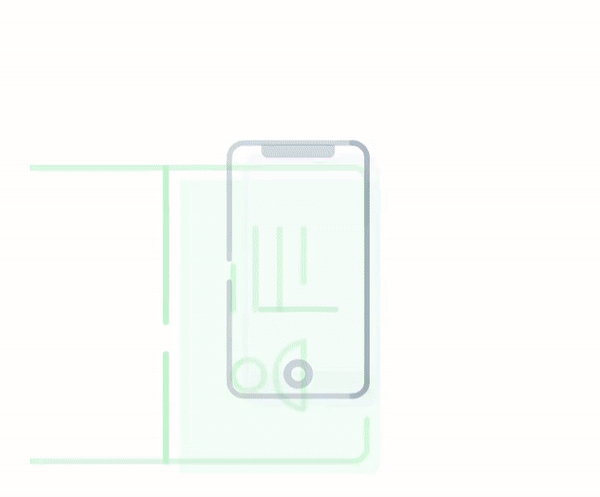

# DOT Graphic Resources

This repository provides additional graphic resources for developers/integrators implementing the Innovatrics Digital Onboarding Toolkit (DOT). Resources can only be used with a valid DOT license.

## AutoCapture Walkthrough Tutorial

This folder contains animations for walkthrough tutorial that should be displayed to the user when using the DOT Face Auto Capture and Document Auto Capture components. These instructions guide the user to take photos of a better quality.

These are animated instructions for [DOT Face Auto Capture](https://developers.innovatrics.com/digital-onboarding/docs/functionalities/face/auto-capture/) in the recommended sequence:
- F0-remove-mask  

- F1-clean-camera  

- F2-phone-vertical  

- F3-light-source  

These are animated instructions for [DOT Document Auto Capture](https://developers.innovatrics.com/digital-onboarding/docs/functionalities/document/auto-capture/) in the recommended sequence:
- D1-clean-camera  

- D2-on-table  

- D3-light-conditions  

- D4-reflections  

### Folder structure

`icons-and-instructions` Contains the icons representing the animations. These can be used also as pictograms in a one-screen tutorial. There are also sample screens of each step of the tutorial for creating mockups in subfolders.

`animated-vector-drawable` Contains the animations in XML format to include in the walkthrough screens.

`lottie` Contains the animations in Lottie native format and in Lottie JSON format to include in the walkthrough screens.

## NFC Reading Animations

This folder contains the default animations displayed to the user when using the [DOT NFC component](https://developers.innovatrics.com/digital-onboarding/docs/functionalities/document/nfc-reading/). These animations guide the user to successfully read the NFC chip in their document using their smartphone.

The animations exist in two versions:
- nfc-animation-passport  

- nfc-animation-id-card  

### Folder structure

`animated-vector-drawable` Contains the animations in XML format.

`lottie` Contains the animations in Lottie native format and in Lottie JSON format.

## Document Turn Animation

This folder contains the animation displayed to the user in the DOT demo apps when scanning two pages of an identity document using the [DOT Document Auto Capture](https://developers.innovatrics.com/digital-onboarding/docs/functionalities/document/auto-capture/) component. This animation guides the user to turn their document to the other side.

- turn-card  

### Folder structure

`lottie` Contains the animations in Lottie native format and in Lottie JSON format.